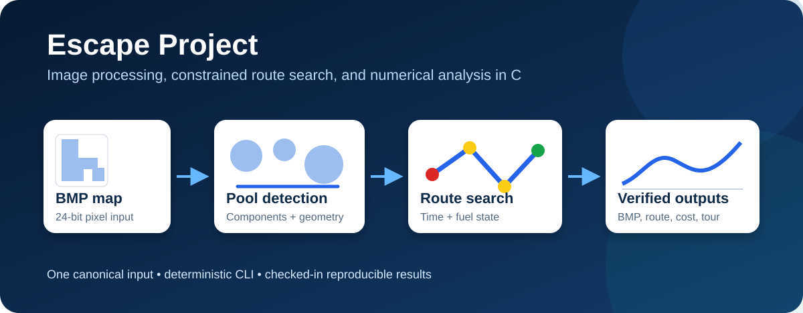
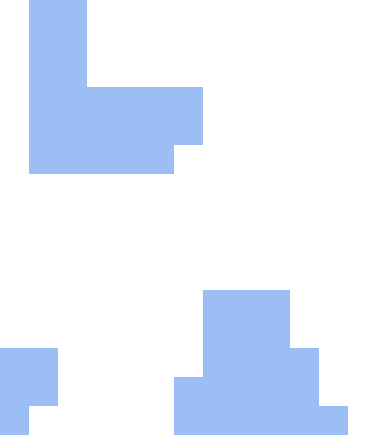
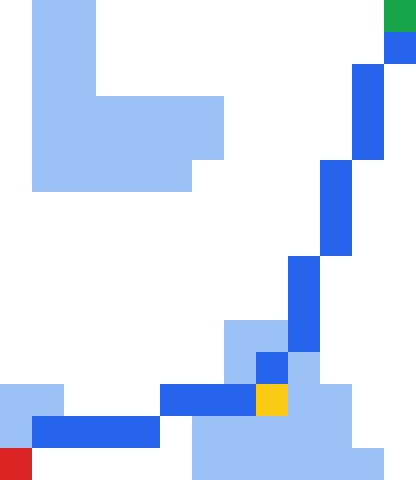

# Escape Project

**Image-based pool detection and fuel-constrained route planning in C.**

<p align="center">
  
</p>

Escape Project models an amphibious field robot that crosses a two-dimensional fish-pool map. The program detects pools in a 24-bit BMP image, derives their geometry, searches for a feasible low-time route under a fuel constraint, evaluates a numerical cost model, and plans a greedy fishing trip.

The implementation is entirely in C. Python appears only in the technical notebook for independent data inspection and visualization.

[Technical notebook](notebooks/escape_project.ipynb) · [C source](src/group7.c) · [Verified outputs](examples/expected) · [MIT License](LICENSE)

## Highlights

- Exact-color BMP segmentation and four-neighbor connected-component detection.
- Pool area and bounding-box center extraction.
- Fuel-constrained recursive route search through the two nearest unvisited pools.
- Route rendering back into a valid BMP image.
- Forward-Euler integration of a nonlinear cumulative-cost model.
- Nearest-neighbor fishing route with order pricing and round-trip fuel cost.
- Interactive menu and deterministic command-line interface.

## Verified sample

The included source image is a deliberately small `13 x 15` pixel map. One pixel represents one square meter. Recomputing the data from the image produces two valid pools; a third blue component contains only five pixels and is rejected by the ten-pixel threshold.

| Quantity | Verified value |
|---|---:|
| Valid pools | 2 |
| Pool centers and areas | `(9,3): 21 m^2`, `(4,12): 23 m^2` |
| Start state | `(1,1)`, `3.0 cm^3` fuel |
| Best route | `(1,1) -> (9,3) -> (13,15)` |
| Travel and extraction time | `125.48 s` |
| Remaining fuel | `3.02 cm^3` |
| Numerical cost at `20.90 m` | `28.176` |

<p align="center">
  
  &nbsp;&nbsp;
  
</p>

The displayed images are nearest-neighbor enlargements of the actual pixel data. Red marks the start, yellow marks a refueling stop, green marks the destination, and blue marks the route.

## Model

For points `P` and `Q`, the Euclidean distance is

$$
d(P,Q)=\sqrt{(x_Q-x_P)^2+(y_Q-y_P)^2}.
$$

The robot moves at `0.2 m/s` and consumes `0.2 cm^3/m`, so a segment of length `d` contributes

$$
t_{move}=5d, \qquad \Delta O_{move}=-0.2d.
$$

A pool of area `A` requires `A` seconds for extraction and adds `0.2A cm^3` of fuel. A segment is feasible only when `O >= 0.2d`.

The numerical cost is integrated with `dx = 0.1`:

$$
c_{k+1}=c_k+0.1\left(\frac{2.5}{c_k+1}+F_k\right),
\qquad
F_k=\begin{cases}1 & \text{movement}\\20 & \text{fuel extraction.}\end{cases}
$$

See the [technical notebook](notebooks/escape_project.ipynb) for the full theory-code-result-interpretation walkthrough.

## Build

Requirements:

- A C11 compiler such as GCC or Clang.
- GNU Make for the convenience targets.
- The standard C math library.

Build with Make:

```bash
make
```

On Windows, use the installed make executable, commonly `mingw32-make` or `gmake`, if `make` is not available as a command alias.

Or compile directly on Linux/macOS:

```bash
mkdir -p build
gcc src/group7.c -std=c11 -O2 -Wall -Wextra -Wpedantic -o build/escape -lm
```

On MinGW, the output is normally `build/escape.exe`.

Direct MinGW build from PowerShell:

```powershell
New-Item -ItemType Directory -Force build | Out-Null
gcc src\group7.c -std=c11 -O2 -Wall -Wextra -Wpedantic -o build\escape.exe -lm
```

## Run

Run the interactive menu from the repository root:

```bash
./build/escape
```

Reproduce the checked-in program outputs:

```bash
make demo
```

Individual operations:

```bash
./build/escape --scan
./build/escape --sort
./build/escape --route 1,1 3
./build/escape --cost 5
./build/escape --fish 30
```

Use `./build/escape --help` for optional input and output paths.

PowerShell users can invoke the Windows executable as `./build/escape.exe` or `.\build\escape.exe`.

## Output artifacts

| Artifact | Produced by | Purpose |
|---|---|---|
| `detected-pools.txt` | `--scan` | canonical map dimensions, pool centers, and areas |
| `best-route.txt` | `--route` | ordered route states with area, time, and fuel |
| `route-overlay.bmp` | `--route` | exact pixel-level escape-route rendering |
| `cost-profile.csv` | `--cost` | complete Euler integration trace with phase labels |
| `fishing-route.bmp` | `--fish` | closed greedy collection route |

Readable PNG enlargements of the tiny BMP outputs are stored in `assets/results/`; they are documentation views, not additional experimental data.

## Verification

The current repository state was checked with:

```bash
make check
make demo
```

The verification covers a warning-clean C11 compilation, all five command paths, the interactive exit path, missing-file and invalid-range failures, notebook JSON, local documentation links, and BMP headers. The verified sample values in this README are read from the checked-in output files.

## Processing pipeline

1. `--scan` reads the BMP, detects connected pool regions, and writes `detected-pools.txt`.
2. `--route` reads those verified properties and searches from a start state to the top-right map cell.
3. The best route is serialized and painted over a copy of the input image.
4. `--cost` reads the route and generates a numerical cost profile.
5. `--fish` uses the same pool data to create a closed greedy collection route.

The route-search structure and state transitions are summarized in [the route-search diagram](assets/diagrams/route-search.svg).

## Repository structure

```text
.
|-- assets/
|   |-- diagrams/       # Architecture and algorithm diagrams
|   `-- results/        # Readable PNG views of verified outputs
|-- examples/
|   |-- input/          # Canonical BMP input
|   `-- expected/       # Reproducible data and program outputs
|-- notebooks/          # Central technical knowledge source
|-- src/                # C implementation
|-- LICENSE
|-- Makefile
`-- README.md
```

## Known limitations

- The BMP reader intentionally accepts only uncompressed 24-bit images.
- Pool segmentation uses the exact RGB value `(155, 190, 245)`; it is not robust to compression or color variation.
- The search expands at most the two nearest unvisited pools at each state, matching the project constraint rather than solving a fully connected shortest-path problem.
- Exhaustive recursion is suitable for the supplied small maps but can grow exponentially with the number of pools.
- The fishing extension is a nearest-neighbor heuristic and is not guaranteed to minimize tour length.
- The tiny canonical sample has total capacity `44`, so it cannot demonstrate the `100+` fish discount branch.

## License

Released under the [MIT License](LICENSE).
