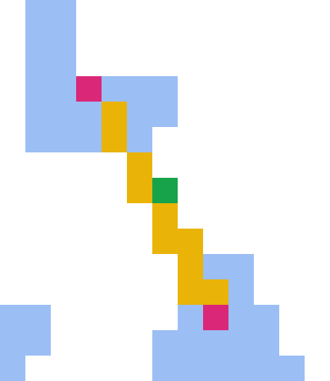
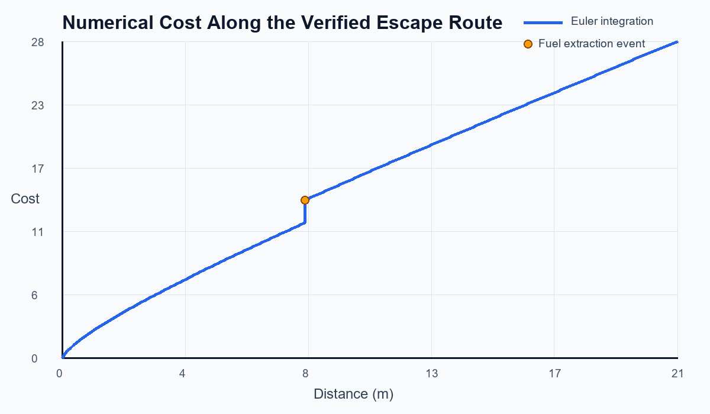

# Escape Project

<p align="center">
  <strong>Image-based pool detection and fuel-constrained route planning in C</strong>
</p>

<p align="center">
  
</p>

<p align="center">
  <a href="notebooks/escape_project.ipynb">Technical notebook</a> |
  <a href="src/group7.c">C source</a> |
  <a href="examples/expected">Verified outputs</a> |
  <a href="LICENSE">MIT License</a>
</p>

Escape Project is a self-contained C11 program that turns a 24-bit BMP map into engineering data and route-planning results. It detects fish pools, extracts their geometry, searches for the minimum-time feasible escape route under a fuel constraint, evaluates a nonlinear numerical cost model, and plans a greedy fishing tour.

The repository is built around one reproducible data flow: the canonical BMP generates the pool table, the pool table drives both planners, and the escape route drives the cost model. The implementation is C; Python is used only inside the notebook for independent inspection and presentation.

## At a glance

| Area | Implementation |
|---|---|
| Image processing | exact-color segmentation and four-neighbor connected components |
| Geometry | pool area and bounding-box center extraction |
| Planning | recursive search through the two nearest unvisited pools |
| Resource model | distance-based fuel consumption and pool-based refueling |
| Numerical analysis | Forward Euler integration with a fixed `0.1 m` step |
| Extension | nearest-neighbor fishing tour and order pricing |
| Interface | interactive menu and deterministic command-line operations |

## Verified demonstration

The checked-in sample is intentionally small: `13 x 15` pixels, with one pixel representing one square meter. The scan finds two valid pools. A third blue component contains only five pixels and is rejected by the ten-pixel threshold.

| Verified quantity | Value |
|---|---:|
| Valid pools | 2 |
| Pool centers and areas | `(9,3): 21 m^2`, `(4,12): 23 m^2` |
| Initial state | `(1,1)`, `3.0 cm^3` fuel |
| Best route | `(1,1) -> (9,3) -> (13,15)` |
| Total route time | `125.48 s` |
| Remaining fuel | `3.02 cm^3` |
| Route length | `20.90 m` |
| Final numerical cost | `28.176` model units |

<table>
  <tr>
    <td align="center">
      <br>
      <sub><b>Canonical input</b><br>Original pool pixels</sub>
    </td>
    <td align="center">
      <br>
      <sub><b>Escape route</b><br>Start, refueling stop, and destination</sub>
    </td>
    <td align="center">
      <br>
      <sub><b>Fishing tour</b><br>Closed nearest-neighbor route</sub>
    </td>
  </tr>
</table>

The PNG files above are nearest-neighbor enlargements of the actual `13 x 15` pixel BMP data. They improve readability without changing the computational result.

<p align="center">
  
</p>

## How the system works

1. **Scan** - read an uncompressed 24-bit BMP and group pool-colored pixels into connected components.
2. **Extract** - reject undersized components, then compute each pool's area and bounding-box center.
3. **Plan** - recursively explore fuel-feasible transitions through the two nearest unvisited pools.
4. **Render** - serialize the best route and paint it onto a valid BMP using Bresenham line rasterization.
5. **Evaluate** - integrate the cumulative cost model along the route and export the complete trace.
6. **Extend** - reuse the same pool data for a closed greedy fishing tour and pricing calculation.

The recursive state transitions are shown in the [route-search diagram](assets/diagrams/route-search.svg).

## Mathematical model

For map points $P$ and $Q$, the Euclidean distance is

$$
d(P,Q) = \sqrt{(x_Q-x_P)^2 + (y_Q-y_P)^2}.
$$

The robot moves at `0.2 m/s` and consumes `0.2 cm^3/m`. Reaching a pool of area $A$ takes $A$ seconds of extraction time and adds $0.2A$ cubic centimeters of fuel. A transition of length $d$ is valid only when the current fuel $O$ satisfies $O \ge 0.2d$.

For a transition that ends at a pool, the state update is

$$
t_{next} = t + 5d + A,
\qquad
O_{next} = O - 0.2d + 0.2A.
$$

The cumulative cost is integrated with Forward Euler and a step of $\Delta x = 0.1\,\mathrm{m}$:

$$
c_{k+1} = c_k + 0.1\left(\frac{2.5}{c_k+1} + F_k\right).
$$

The action term distinguishes between movement and fuel extraction:

- $F_k = 1$ during movement.
- $F_k = 20$ at a fuel-extraction event.

The [engineering notebook](notebooks/escape_project.ipynb) contains the complete derivation, variable definitions, C excerpts, complexity analysis, reported legacy results, and interpretation of every verified output.

## Quick start

### Requirements

- GCC or Clang with C11 support
- GNU Make for the convenience targets
- the standard C math library

### Linux or macOS

```bash
make
./build/escape --scan
./build/escape --route 1,1 3
```

### Windows with MinGW

Use the installed Make command, commonly `mingw32-make` or `gmake`:

```powershell
gmake
.\build\escape.exe --scan
.\build\escape.exe --route 1,1 3
```

Direct compilation is also supported:

```bash
gcc src/group7.c -std=c11 -O2 -Wall -Wextra -Wpedantic -o build/escape -lm
```

On Windows, use `build/escape.exe` as the output path.

## Command-line interface

Run without arguments for the interactive menu, or use a deterministic operation:

```text
escape --scan  [bmp] [pools-output]
escape --sort  [pools]
escape --route X,Y FUEL [bmp] [pools] [route-output] [overlay-output]
escape --cost  INTERVAL [route] [csv-output]
escape --fish  COUNT [bmp] [pools] [overlay-output]
escape --help
```

Reproduce every checked-in program output from the repository root:

```bash
make demo
```

## Output artifacts

| Artifact | Command | Contents |
|---|---|---|
| `detected-pools.txt` | `--scan` | map dimensions, pool centers, and areas |
| `best-route.txt` | `--route` | ordered route states with time and remaining fuel |
| `route-overlay.bmp` | `--route` | exact pixel-level escape-route rendering |
| `cost-profile.csv` | `--cost` | complete Euler integration trace and phase labels |
| `fishing-route.bmp` | `--fish` | exact pixel-level closed fishing tour |

Canonical inputs live under `examples/input/`; reproducible program outputs live under `examples/expected/`; readable documentation views live under `assets/results/`.

## Verification

The repository is checked with strict compiler warnings and an end-to-end demonstration:

```bash
make check
make demo
```

The verification performed for this version covers:

- warning-clean C11 compilation with `-Wall -Wextra -Wpedantic -Wconversion -Wshadow`;
- all five command paths and the interactive exit path;
- missing-file and invalid-range failure handling;
- consistency between the canonical BMP, detected pool table, route, and cost trace;
- notebook JSON, local documentation links, SVG structure, and BMP headers;
- absence of personal and institutional information in the current repository tree.

The numerical values in this README come directly from the checked-in verified outputs. They are reproducible software results, not physical hardware measurements.

## Repository structure

```text
.
|-- assets/
|   |-- diagrams/       # Architecture and route-search diagrams
|   `-- results/        # Readable PNG views of verified outputs
|-- examples/
|   |-- input/          # Canonical BMP input
|   `-- expected/       # Reproducible program outputs
|-- notebooks/          # Central technical knowledge source
|-- src/                # C11 implementation
|-- .gitattributes      # GitHub Linguist and file handling rules
|-- LICENSE             # MIT License
|-- Makefile            # Build, validation, and demo targets
`-- README.md
```

## Known limitations

- The BMP reader intentionally accepts only uncompressed 24-bit images.
- Pool segmentation requires the exact RGB value `(155, 190, 245)` and is not robust to compression or color drift.
- The route search expands at most the two nearest unvisited pools, matching the project constraint rather than solving a fully connected shortest-path problem.
- Recursive enumeration can grow exponentially with the number of pools.
- The fishing extension is a nearest-neighbor heuristic and is not guaranteed to minimize tour length.
- The canonical sample has total capacity 44, so its reproducible run cannot exercise the `100+` fish discount branch. Larger historical demonstrations are documented separately in the notebook.

## Documentation

Use the README as the project overview and the [technical notebook](notebooks/escape_project.ipynb) as the central engineering reference. The notebook follows a theory-code-result-interpretation structure and includes the full mathematics, data contracts, algorithms, results, verification matrix, complexity analysis, and engineering conclusions.

## License

Released under the [MIT License](LICENSE).
